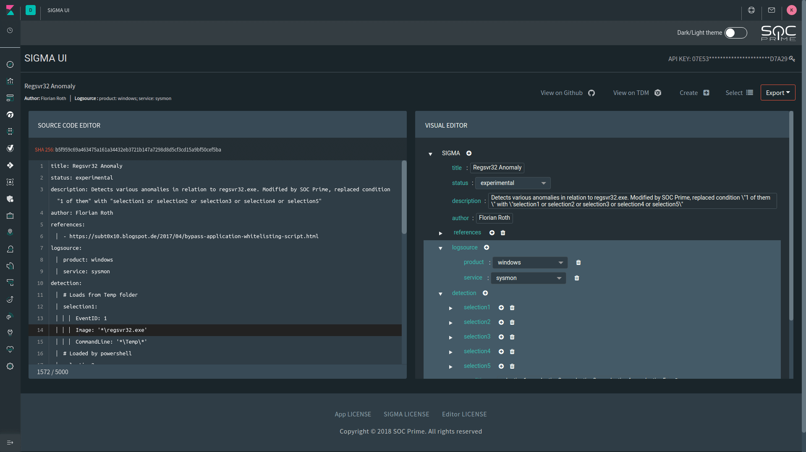

# Sigma UI
​
SIGMA UI is a free open-source application based on the Elastic stack and Sigma Converter (sigmac). It simplifies development, use and sharing of Sigma, a generic rule format for SIEM systems. It is now possible to write, update and export Sigma rules straight from Kibana web UI for all supported Sigma backends including: Elastic stack, ArcSight, QRadar, Splunk, Qualys, Logpoint, Graylog and Windows Defender ATP. If you’re using the Elastic stack for threat hunting purposes or as a primary SIEM, SIGMA UI has capabilities to drill-down directly from a rule to a search in Discover section of Kibana. Community Sigma rules are included with the application. Integration with Sigma official Github and SOC Prime TDM repositories in on the short-term roadmap.
​



​
Sigma UI requires **pyhon2.7** and using **sigmac** script to convert sigma to different SIEM languages. 
It requires **python3.6** with libraries:
```sh
PyYAML>=3.11
```
Details: https://github.com/Neo23x0/sigma/tree/master/tools
## To install the Sigma UI plugin for your Kibana: ###

##### 1. Copy the file sigma-ui-xxxxx.zip to the Kibana server and run the command:
```sh
/usr/share/kibana/bin/./kibana-plugin install file:///PATH_TO_FILE/sigma-ui-xxxxx.zip
```

Wait until the installation finishes, it may take a few minutes to optimize and cache browser bundles. Restart Kibana using the systemctl restart kibana command to apply the changes.
> If you get the error: "Plugin installation was unsuccessful due to error "Incorrect Kibana version in plugin [socprime_sigma_ui]. Expected [7.6.0]; found [6.6.1]", please open the zip archive and modify file ./kibana/socprime_sigma_ui/package.json": put the version of your Kibana to the field "kibana.version".

##### 2. Restart Kibana using the systemctl restart kibana command to apply the changes.
> In case if after restarting Kibana you don’t see any changes, go to /usr/share/kibana/optimize. Delete all files in the ‘optimize’ folder, including subfolders. Then restart Kibana. This will make Kibana refresh its cache.

##### 3. Sigma UI plugin is using indices: 
"sui_config" - to store App config;

"sui_sigma_doc" - for sigma documents;

Create index templates for these index from file **index_template_sigma_ui.txt**

To fill sigma docs and to index:

Copy to the server which has access to Elasticsearch database folder **ELK_import_export**. 

Modify script es_config.py, specify your credentials:

* ES_host = ['localhost']
* ES_http_auth = None #('login', 'password')
* ES_port = 9200
* ES_scheme = "http" # "http" or "https"

Run command:
```sh
python /PATH_TO_FILE/import_es_index.py
```

Indices will be created and filled with sigma rules.

>You should have the elasticsearch module, for python 2.7 install it using the command:
>```sh
>pip install elasticsearch
>```

##### 4. You can receive Sigma rules from TDM using the TDM API:
Extract the contents of the archive **script_tdm_api.zip** to your folder for scripts, for example ```/opt/scripts/```.
First of all, you should install script dependencies in the **script_tdm_api** folder using the following command:
```sh
pip install -Ur requirements.txt
```

Specify your settings for script work in the following file: 
```kibana/plugins/socprime_sigma_ui/config/common.json``` 
```json
{
 "debug": true,
 "max_upload_period_in_month": 2,
 "python_path": "/usr/bin/python3.6",
 "tdm_api_integration_tool_path": "/opt/scripts/script_tdm_api/tdm_api_for_sigma_ui.py",
 "tpm_sigma_folder_path": "/opt/scripts/script_tdm_api/sigmas"
}
```

This script gets new Sigma rules published on TDM, by API. The script uploads Sigma rules with the latest updated date in **sui_sigma_doc**; or if the time range is bigger than is specified in **max_upload_period_in_month**, then it uses the **max_upload_period_in_month** value.

The script gets all available Sigma rules for your Company registered in TDM. 

The script uses a temporary directory for store data received from TDM API. The path can be specified in **tpm_sigma_folder_path**. The received data are saved in the file in '*.json' format.Other settings meaning:

```"debug": true``` - turn on sending the bugs/mistakes from backend;
```"python_path": "/usr/bin/python3.6"``` - path to the python script;
```"tdm_api_integration_tool_path": "/opt/scripts/script_tdm_api/tdm_api_integration_tool.py"``` - path to the script for updating the TDM Sigma rules using TDM API;

##### 5. Now you can use the Sigma UI plugin.

## TO-Do
- [ ] Refactor the editor code as currently it is one huge file
- [X] SOC Prime TDM integration to pull new Sigmas via API
- [ ] Github integration to pull new Sigmas via API
- [ ] Add auto-save feature and draft saves
- [ ] Update tooltips for automatic spell checking
- [X] Populate dictionaries with more log sources
- [ ] Optimize the app backend for better performance
- [ ] move all code from python 2.7 to python 3

